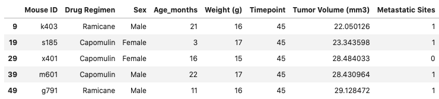
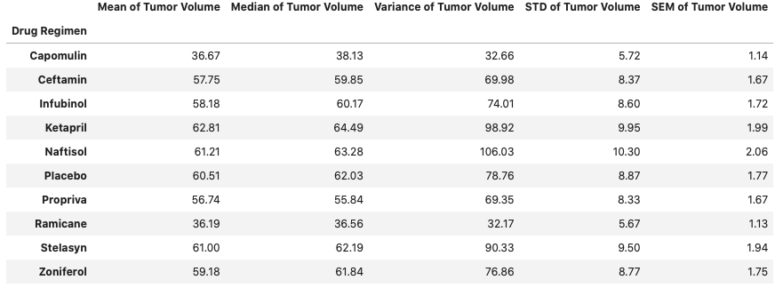
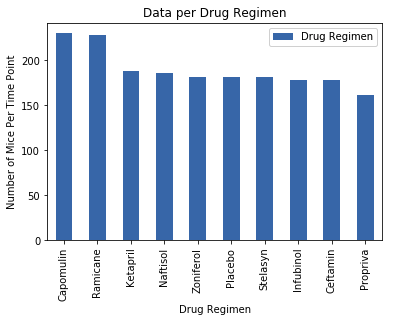
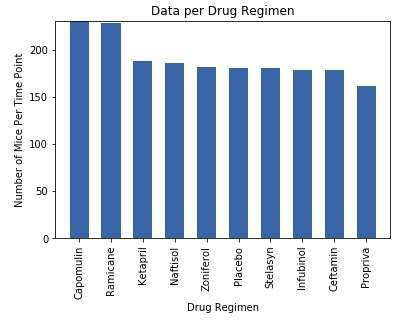
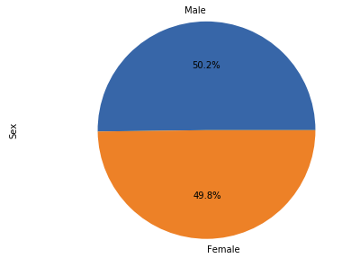
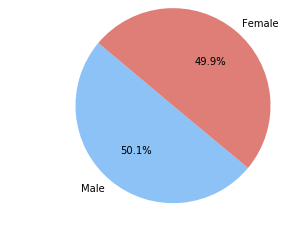
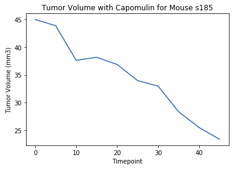
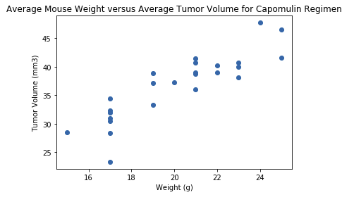
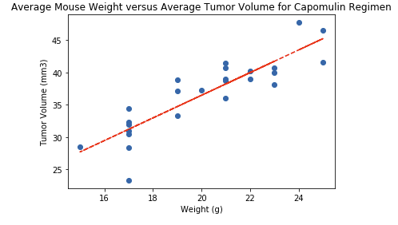

# Pymaceuticals
Matplotlib Scripts


While your data companions rushed off to jobs in finance and government, you remained adamant that science was the way for you. Staying true to your mission, you've joined Pymaceuticals Inc., a burgeoning pharmaceutical company based out of San Diego. Pymaceuticals specializes in anti-cancer pharmaceuticals. In its most recent efforts, it began screening for potential treatments for squamous cell carcinoma (SCC), a commonly occurring form of skin cancer.

As a senior data analyst at the company, you've been given access to the complete data from their most recent animal study. In this study, 249 mice identified with SCC tumor growth were treated through a variety of drug regimens. Over the course of 45 days, tumor development was observed and measured. The purpose of this study was to compare the performance of Pymaceuticals' drug of interest, Capomulin, versus the other treatment regimens. You have been tasked by the executive team to generate all of the tables and figures needed for the technical report of the study. The executive team also has asked for a top-level summary of the study results.

## Technologies
* Python
* Matplotlib
* Pandas
* Numpy
* Scipy

## Instructions

Your tasks are to do the following:

* Before beginning the analysis, check the data for duplicate mice and remove any data associated with that mouse ID.
```python
# Combine the data into a single dataset
combined_data_df = pd.merge(mouse_metadata, study_results, how='outer', on='Mouse ID')
combined_data_df.head()

# Checking the number of mice in the DataFrame.
number_of_dup_mice_df = combined_data_df["Mouse ID"].count()
print("Duplicates:", number_of_dup_mice_df)

number_mice_count_df = combined_data_df["Mouse ID"].nunique()
print("Number of Mice:", number_mice_count_df)

# Getting the duplicate mice by ID number that shows up for Mouse ID and Timepoint. 
number_of_dup_mice_df = combined_data_df.groupby("Mouse ID")["Timepoint"].nunique()
number_of_dup_mice_df

combined_data_drop = combined_data_df.drop_duplicates(subset="Mouse ID", keep="last")
# Checking the number of mice in the clean DataFrame.
print(number_mice_count_df)
combined_data_drop.head()
```



* Generate a summary statistics table consisting of the mean, median, variance, standard deviation, and SEM of the tumor volume for each drug regimen.

```python
mean_tumor = combined_data_drop.groupby(['Drug Regimen']).mean()["Tumor Volume (mm3)"]
median_tumor = combined_data_drop.groupby(['Drug Regimen']).median()["Tumor Volume (mm3)"]
variance_tumor = combined_data_drop.groupby(['Drug Regimen']).var()["Tumor Volume (mm3)"]
std_tumor = combined_data_drop.groupby(['Drug Regimen']).std()["Tumor Volume (mm3)"]
sem_tumor = combined_data_drop.groupby(['Drug Regimen']).sem()["Tumor Volume (mm3)"]

summary_stats_table =pd.DataFrame({'Mean of Tumor Volume':mean_tumor,
                          'Median of Tumor Volume':median_tumor,
                          'Variance of Tumor Volume':variance_tumor,
                          'STD of Tumor Volume':std_tumor,
                          'SEM of Tumor Volume': sem_tumor})

summary_stats_table.round(2)
```


* Generate a bar plot using both Pandas's `DataFrame.plot()` and Matplotlib's `pyplot` that shows  the number of mice per time point for each treatment regimen throughout the course of the study.

```python
# Generate a bar plot showing the number of mice per time point for each treatment throughout the course of the study using pandas.
drugs_total = pd.DataFrame(pd.value_counts(combined_data_df["Drug Regimen"]))

%matplotlib inline
# pandas plot
drugs_total.plot(kind = "bar")
plt.title("Data per Drug Regimen")
plt.ylabel("Number of Mice Per Time Point")
plt.xlabel("Drug Regimen")
plt.show()
plt.tight_layout()
```


```python
# Generate a matplotlib bar plot showing the number of mice per time point for each treatment throughout the course of the study using pyplot.
x_axis = combined_data_df["Drug Regimen"].value_counts().index
y_axis = combined_data_df["Drug Regimen"].value_counts()
plt.bar(x_axis,y_axis, width = .6)
plt.xticks(x_axis, rotation = 90)
plt.xlim(-0.75, len(x_axis)-0.25)
plt.ylim(0, max(y_axis)+0.4)
plt.ylabel("Number of Mice Per Time Point")
plt.xlabel("Drug Regimen")
plt.title("Data per Drug Regimen")
plt.show()
```


* Generate a pie plot using both Pandas's `DataFrame.plot()` and Matplotlib's `pyplot` that shows the distribution of female or male mice in the study.
```python
# Generate a pie plot showing the distribution of female versus male mice using pandas
gender_total = pd.value_counts(combined_data_drop['Sex'])

#pandas pie plot
gender_pandas = gender_total.plot(kind="pie", y="sex", autopct='%1.1f%%')
gender_pandas.set_ylabel("Sex")

plt.tight_layout()
plt.axis("equal")
plt.show()
```


```python
# Generate a pie plot showing the distribution of female versus male mice using pyplot
sizes = [325, 324]
plt.pie(
    sizes, 
    labels=["Male","Female"],          
    colors=["lightskyblue","lightcoral"],
    autopct='%1.1f%%',                                         # Formats percentages
    startangle=140
)

# Tells matplotlib that we want a pie chart with equal axes
plt.axis("equal")

plt.show()
```


* Using Matplotlib, generate a box and whisker plot of the final tumor volume for all four treatment regimens and highlight any potential outliers in the plot by changing their color and style.

```python
# Generate a box plot of the final tumor volume of each mouse across four regimens of interest
fig1, ax1 = plt.subplots()
ax1.boxplot([x_axisC, x_axisR, x_axisP, x_axisCe])
ax1.set_ylabel('Final Tumor Volume (mm3)')
ax1.set_xticklabels(["Capomulin", "Ramicane", "Propriva", "Ceftamin"])
plt.show()
```


* Generate a line plot of time point versus tumor volume for a single mouse treated with Capomulin.
```python
# Generate a line plot of time point versus tumor volume for a mouse treated with Capomulin
x_axis =combined_data_df.loc[combined_data_df["Mouse ID"]== "s185"]
x_axis = x_axis["Timepoint"]

y_axis =combined_data_df.loc[combined_data_df["Mouse ID"]== "s185"]
y_axis = y_axis["Tumor Volume (mm3)"]

plt.plot(x_axis, y_axis)
plt.title("Tumor Volume with Capomulin for Mouse s185")
plt.xlabel("Timepoint")
plt.ylabel("Tumor Volume (mm3)")
```


* Generate a scatter plot of mouse weight versus average tumor volume for the Capomulin treatment regimen.
```python
mouse_weight = mouse_weight_capomulin["Weight (g)"]
tumor_volume = mouse_weight_capomulin["Tumor Volume (mm3)"]
plt.scatter(mouse_weight, tumor_volume)
plt.title("Average Mouse Weight versus Average Tumor Volume for Capomulin Regimen")
plt.xlabel("Weight (g)")
plt.ylabel("Tumor Volume (mm3)")
plt.show()
```


* Calculate the correlation coefficient and linear regression model between mouse weight and average tumor volume for the Capomulin treatment. Plot the linear regression model on top of the previous scatter plot.
```python
# Calculate the correlation coefficient and linear regression model 
# for mouse weight and average tumor volume for the Capomulin regimen
correlation = stats.pearsonr(mouse_weight, tumor_volume)
print(f"The correlation between both weight and tumor volume is {round(correlation[0],2)}")

(slope, intercept, rvalue, pvalue, stderr) = stats.linregress(mouse_weight, tumor_volume)
regress_values = slope * mouse_weight + intercept
plt.scatter(mouse_weight, tumor_volume)
plt.plot(mouse_weight, regress_values, "--", color="r")
plt.title("Average Mouse Weight versus Average Tumor Volume for Capomulin Regimen")
plt.xlabel("Weight (g)")
plt.ylabel("Tumor Volume (mm3)")
plt.show()
```


## Observations
* There were more trials done for certain drugs than others, so the information is skewed. Capomulin, Ramicane ,Ketapril, and Naftisol had more # of trials than other drugs given.
* When looking at signs of progression in drug regimen treatment, we took a look at the mean of tumor size into consideration due to the skewed data of number of drug trials that were done that might be more than others.
